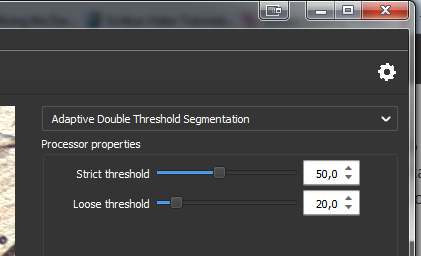
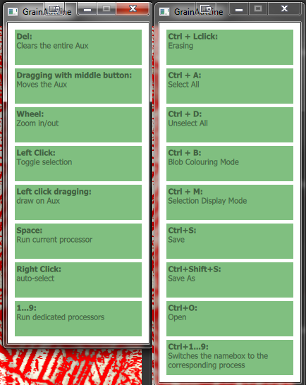
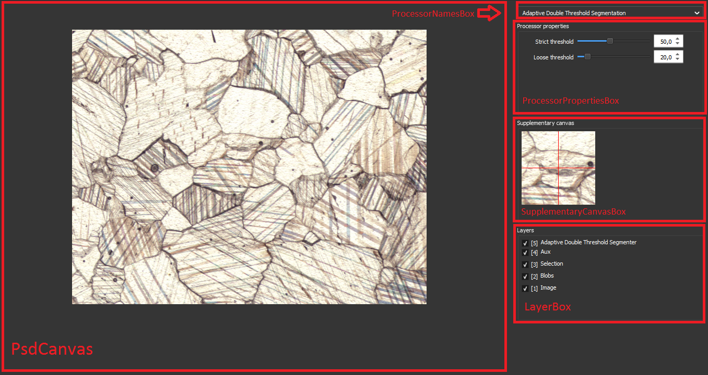
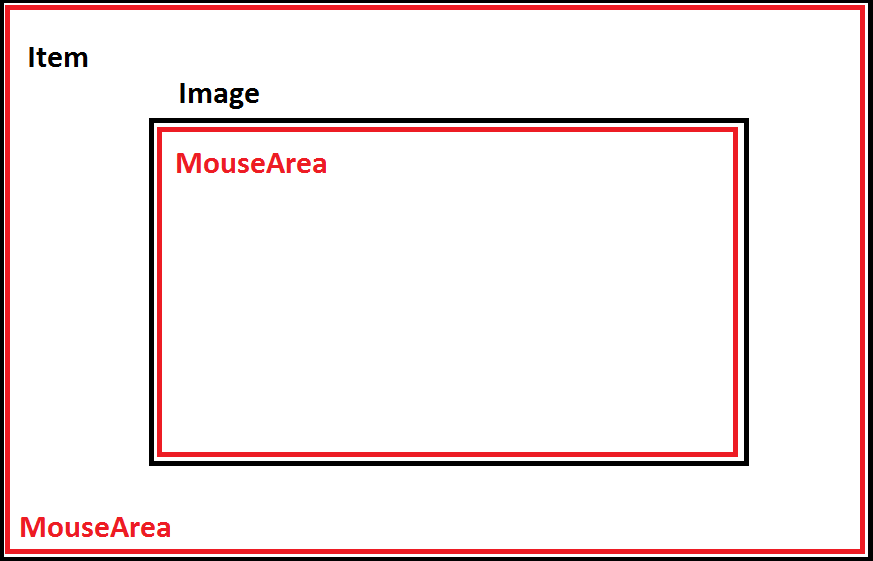
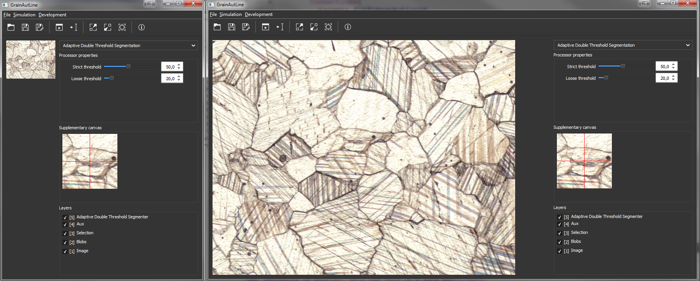

# GrainAutLine QML dokumentáció

## A C++ és a QML oldal kapcsolata

A QML bevezetésével lehetõvé vált az alkalmazások logikájának és felhasználói felületének a szétválasztására.
Azonban a C++-on alapuló programmûködés, és a Javascripten alapuló QML-en megírt GUI közötti kapcsolat meglétéhez további lépésekre van szükség. Ez a rész azokat a szignálokat, és objektumokat írja le, amiken keresztül ez a kapcsolat megvalósul, valamint a kapcsolat kialakításának a módját is dokumentálja.

A kapcsolat kialakításának a helye a `main.cpp`-ben található meg.

###  C++ objektumok elérhetõvé tétele a QML oldalon

A program jelenleg két objektumot oszt meg a felhasználó felület számára:

- `Logger`: Ez egy singleton naplózó osztály, amit LogWindow.qml modellként használ, hogy megjelenítse a rendszernek a fontosabb eseményeit.
- `SlotManager` :Ennek az osztálynak három tagváltozója érhetõ el a QML oldalon:
	1. int `ActiveSlot`
	2. `QString OpenedFile`: Az éppen megnyitott fájlnak a nevét tartalmazza, a QML oldalon csak arra van használva, hogy megnézze éppen van-e megnyitott fájl.
	3. `bool ProcessorRunning`: Jelzi hogy van-e éppen futó process

Az objektumok megosztásának a módja a következõ:

	//main.ccp:
	
	//...
	context->setContextProperty(QStringLiteral("SlotManager"), &slotManager);
	//...
	context->setContextProperty(QStringLiteral("Logger"), &Logger::GetInstance());
	//...
Elérhetõvé tenni egy osztálynak a tagváltozóit a `Q_PROPERTY()` makró segítségével lehetséges, részletek: 

 http://doc.qt.io/qt-5/qobject.html#Q_PROPERTY

Ezen kívül még két típus is be van regisztrálva: az absztrakt `Processor` és a `ProcessorSlot` osztály. Így ezeknek az osztályoknak a tulajdonságai elérhetõek a QML oldalon

### C++ és QML szignálok összekapcsolása

Az alábbi QML szignálok vannak összekapcsolva a SlotManager(ezen az osztályon keresztül történik a kommunikáció) megfelelõ függvényeivel:

- `keyPressed(int, int)`: A QML oldal a különbözõ gomblenyomáshoz tartozó eseményeket elõször lekezeli magának, majd továbbdobja a C++ oldal számára.
- Az alábbi szignálok jeleznek a SlotManager-nek ha valami történik a vászonnal:
	- canvasMousePressed(QString,QPointF,int,int,int)
	- canvasMouseReleased(QString,QPointF,int,int,int)
	- canvasMouseDoubleClicked(QString,QPointF,int,int,int)
	- canvasMouseMoved(QString,QPointF,int,int)
	- canvasSizeChanged(QString,QSizeF)
- fileOpened(QUrl): Jelez ha meg kell nyitni egy adott fájlt.
- fileSavedAs(QUrl): Jelez, hogy az éppen megnyitott fájlt a paraméterben megadott helyre kell lementeni
- `runTriggered()`: Ha el kell indítani egy folyamatot.

Ezen kívül még van egy szignál ami az `ImageProvider` objektumhoz kapcsolódik:
- renderComplete(QString)

### ImageProvider osztály

## A QML oldal felépítése:

### main.qml

Ez az a fájl amit a C++ oldalon betöltenek, és közvetetten ez tölti be a projekthez tartozó egyéb QML fájlokat. Itt található meg a menü és az eszköztár, valamint azok az Action-ök, amik az elõbbiekhez kellenek. Ezeken kívül a dialógusablakok is itt vannak példányosítva:

- `LogWindow.qml`: Ezen keresztül lehet látni a program fontosabb eseményeit.
- `CheetSheet.qml`: Ez a lenyomott módosító (modifier) gombtól függõen ad segítséget az éppen elérhetõ gyorsbillentyûkhöz.
- 2 db FileDialog: egy a fájl megnyitásához, egy fájl mentéséhez.
- 1 db MessageDialog ami az olyan funkciók esetén ugrik fel, amik még nincsenek megvalósítva.

Minden egyéb elem ami a felhasználói felülethez tartozik, bele van rakva egy külön fájlba, a MainForm.qml-be, így átláthatóbb a kód. A main.qml-ben példányosított MainForm elem úgy van kialakítva, hogy mindig "fókuszban" legyen, így minden egyes KeyEvent-et ez az elem kezel le mielõtt továbbadná a C++ oldalnak. 

#### Process is running display

A programnak egyes mûveletei hosszabb ideig is eltarthatnak, és a felhasználó számára sokszor nem egyértelmû, hogy éppen csinál-e valamit a program, vagy hogy a kiadott parancsot egyáltalán elkezdte-e végrehajtani vagy sem. Ennek kiküszöbölésére annyiban módosítva lett a GUI, hogy valahányszor éppen valamilyen Processz fut, akkor azt egy forgó fogaskerékkel jelzi, az eszköztárnak a jobbszélén.

A fenti funkció létrehozásához egy fogaskerekes képet és egy hozzá tartozó forgató animációt kellet létrehozni:

	    Image{ // Gear Wheel
                  id: gearWheelID
                  anchors.verticalCenter: parent.verticalCenter
                  anchors.right: parent.right
                  anchors.rightMargin: 6
                  visible: processorRunning
                  width: 18
                  height: 18
                  source: "qrc:///icons/gear.svg"

                  RotationAnimation on rotation{ //Spinning animation for the gear wheel
                    id: wheelAnimationID
                    running: processorRunning
                    loops: Animation.Infinite
                    from:0
                    to:360
                    duration: 1000
                  }
                }
Az animáció elvileg folyamatosan ismétli magát, de mind az animáció, mind a kép csak akkor jelenik meg, ha éppen fut valamilyen folyamat, azaz `bool processorRunning` értéke `true`.

#### Run & Show process shortcuts

A könnyen kezelhetõség érdekében szükség volt olyan gyorsbillentyûkre, amiknek a segítségével gyorsan le lehet futtatni az elérhetõ mûveleteket, valamint olyanokra amikkel gyorsan lehet váltogatni a kezelõfelületen, az éppen kijelölt mûveletek között. Ez úgy lett megoldva, hogy a `Ctrl+0-9` gombok lenyomásával kiválasztódik a `ProcessorNamesBox`-nak a lenyomott számnak megfelelõ indexû eleme. Ha csak simán megnyomjuk a `0-9` gombokat, akkor ezen felül még kiadja a `runTriggered()` szignált is, ezzel jelezve a `SlotManager`-nek, hogy az éppen kijelölt mûveletet hajtsa végre.

Ennek a megvalósítása a `MainForm` elemnek a KeyEvent-eket kezelõ függvényében található:

	        Keys.onPressed:{
          // Run & Show shortcut
          var tmp = event.key - Qt.Key_0
          if( tmp>=0 && tmp<=9 ){
            showProcess(tmp)
            if(!(event.modifiers & Qt.ControlModifier))
              runTriggered()
          }
Ha a lenyomott gomb a `0-9` gombok valamelyike, akkor meghívja a `showProcess(index)` függvényt, ami  a forwardolt `processorNamesBox` elemnek az éppen kiválasztott elemét megváltoztatja, ezen felül ha a `Ctrl módosító` is le volt nyomva akkor még kiadja a `runTriggered()` szignált is.

	// main.qml:
    function showProcess(index){
      namesBox.currentIndex=index;
    }
	//...
	property alias namesBox: mainFormId.namesBox
	
	//MainForm.qml:

	//Forwarding processorNamesBox
	property var namesBox: processorNamesBox
	
#### Cheat Sheet

Ez az ablak ad információt az éppen elérhetõ gyorsbillentyûkrõl, a lenyomott módosító gombok függvényében. A mérete nem változtatható a felhasználó által, automatikusan igazodik a az adott helyzetben elérhetõ gyorsbillentyûk számához.

Az egész elemnek az alapja lényegében egy `ListView` aminek a `model property` értékét dinamikusan változtatjuk a lenyomott módosító gomboknak megfelelõen. Az adatmodellek egy `Item` elemen belül találhatóak, a `rescoures property`-n belül, ami a nem vizuális leszármazottaknak a listája. Ha csak egyszerûen az Item-en belül lennének elhelyezve a modellek, akkor is ebben lennének listázva, de így hangsúlyosabb, hogy ennek az elemnek pusztán a tárolás a célja.

	   Item{
      id: modelContainerID
      resources: [
        ListModel{
          id: model1
          // IF NOTHING IS PRESSED:
          ListElement{description: "Clears the entire Aux" ; shortcut: "Del"}
          //...
          ListElement{description: "auto-select"; shortcut: "Right Click" }
          ListElement{description: "Run dedicated processors"; shortcut: "1...9" }
        },
        ListModel{
          id: model2
          // IF Ctrl IS PRESSED:
          ListElement{description: "Erasing" ; shortcut: "Ctrl + Lclick"}
          //...
          ListElement{description: "Save As"; shortcut: "Ctrl+Shift+S" }
          ListElement{description: "Open"; shortcut: "Ctrl+O" }
        }
      ]
    }
   A megoldásnak az elõnye, hogy a bõvítése könnyen megoldható: ha például azt szeretnénk, hogy az `Alt` gomb lenyomására is reagáljon, akkor csak hozzá kell adni egy újabb modellt, amiben az Alt gombhoz tartozó gyorsbillentyûket felsoroljuk.
  
 A modellnek a cseréjét a `change_model(index)` függvény végzi:

	// CheatSheet.qml:
	   function change_model(index){
    list1_ID.model = modelContainerID.resources[index]
    
	    rootID.minimumHeight = 0;
	    rootID.maximumHeight = margins * 2 + list1_ID.model.count * (delegate_height + spacing) - spacing
	    rootID.height = maximumHeight
	    rootID.minimumHeight = maximumHeight
	    }
    }
A függvényen belül azért van szükség az ablaknak a minimum és maximum értékének az állítgatására, mert az ablaknak a mérete úgy lett megoldva, hogy a minimum és a maximum érték mindig a pillanatnyi értékre állítódik. Azonban ezzel az a gond, hogy a pillanatnyi értéket csak a minimum és maximum közötti értékre lehet beállítani, ezért ha változnia kell a pillanatnyi értéknek a módosult tartalom miatt, akkor elõször a minimumot és maximumot úgy kell beállítani, hogy a pillanatnyi érték megváltoztatható legyen.

Mivel minden KeyEvent-et a `main.qml`-ben példányosított `MainForm` elem kap meg - köszönhetõen annak, hogy mindig fókuszban van -,  ezért a `CheatSheet`-hez tartozó eseményeket is itt kell lekezelni:

	    MainForm {
        id: mainFormId
        //...
        Keys.onPressed:{
        //...
        if(event.modifiers & Qt.ControlModifier)
            chiChiId.change_model(1)
          else
            chiChiId.change_model(0)
        //...
        }
        // For the Cheat Sheet
        Keys.onReleased:{
          if(event.modifiers & Qt.ControlModifier) chiChiId.change_model(1)
          else                                     chiChiId.change_model(0)
        }
        
    }//MainForm

### MainForm.qml

A menüt és az eszköztárat leszámítva a fõablaknak minden grafikus eleme ebben a fájlban van példányosítva, nevezetesen:

- `PsdCanvas`: Ez a vászna a programnak amire rajzolni lehet, és amin megjelennek a különbözõ Aux rétegek.
-  `ProcessorNamesBox`: Egy lenyíló lista, amin keresztül ki lehet választani az éppen végrehajtandó mûveletet. A `SlotManager`-t és a `ProcessorSlot`-ot használja adatmodellnek, és tõle kérdezi le az elérhetõ mûveleteknek a nevét
- `ProcessorPropertiesBox`: Az éppen kiválasztott mûvelethez tartozó beállításokat jeleníti meg. Ez a `SlotManager`-t a `ProcessorSlot`-ot valamint `Processor`-t használja adatmodellként, és tõlük kérdezi le az adott mûvelethez tartozó funkciókat.
- `SupplementaryCanvasBox`: Ez a `PsdCanvas`-nak egy módosítása, ami arra használatos, hogy segítsen a tájékozódásban rajzolás közben
- `LayerBox`: Ezen keresztül lehet állítani, hogy éppen melyik réteg legyen látható, és milyen fokú áttetszõséggel. A `SlotManager`-t és a `ProcessorSlot`-ot használja adatmodellként.

### PsdCanvas.qml

Ez tulajdonképpen egy `Image` elembõl áll ami a vásznat alkotja meg, amire rajzolni lehet. A vászon nagyításnak és mozgatásának megvalósításához ez az elem még rendelkezik átskálázó és mozgató transzformációkkal: `imageScaleTransformID`, `imageTranslateTransformID`. Ezeken keresztül lehet a képen végrehajtani a megfelelõ transzformációkat.

#### PsdCanvas.qml felépítése

Két különbözõ `MouseArea` található a `PsdCanvas`-ban:

- Az elsõ az folyamatosan követi méretben és pozícióban a vásznat, és a C++ oldallal tart kapcsolatot: Jelez ha bármilyen ha valamilyen esemény történik a vászonnal (`canvasMouseDoubleClicked`, `canvasMouseReleased`, stb...)
- A második a teljes teret kitölti, és ez kezeli a vászonnak a nagyítását és mozgatását.

#### Zoom in & Zoom out

	  MouseArea {
        id: areaID
        //...
        onWheel: {
            //var imageScale = imageScaleTransform.scale / 15 // for smooth scaling 
            var point = mapToItem(imageID, wheel.x, wheel.y);

            if (wheel.angleDelta.y > 0) {
                zoom(imageContainer.zoom_in, point);
            } else {
                zoom(imageContainer.zoom_out, point);
            }
        }
        //...
A görgetés során a kurzor poziciójánál lévõ képpontot helyben hagyja, így érzõdik természetesnek a használata. Azonban minden vizuális elemnek megvan a saját koordinátarendszere, és ha a két elem nincs pont ugyanabban a pozícióban, akkor a `MouseArea` eseményébõl vett koordináta nem egyezik meg a kurzor által mutatott képpont koordinátjával, ezért ezt át kell transzformálni. Ezt a célt szolgálja a `mapToItem()` függvény, ami a kurzor koordtinátáiról megmondja, hogy az  `Image` elemnek a koordinátarendszerében hol helyezkedik el.
A zoomolást a `zoom(direction, point)` függvény vézi el:

	function zoom(direction, point){
      imageID.scale_img(direction);

      if(typeof(point)==='undefined')
        point = areaID.mapToItem(imageID, center_canvas.x, center_canvas.y);

      var scale_dif = imageScaleTransformID.scale - imageScaleTransformID.prev_scale;
      imageTranslateTransformID.x -= point.x * scale_dif;
      imageTranslateTransformID.y -= point.y * scale_dif;
    }
A zoomoláshoz elõször is a képet át kell skálázni (scale_img függvény), azonban ahhoz hogy a kívánt pont helyben maradjon (point koordináta), ahhoz el is kell tolni valamennyivel. Ha point nincs megadva, akkor automatikusan a képernyõ közepét hagyja helyben, ami azért lehet fontos, mert az eszköztárból is lehet nagyítani, és ebben az esetben nincs megadott koordináta.

#### Fit to Page

Ez a funkció pont annyira nagyítja ki  a képet, hogy teljesen kiférjen a vászonra:

	    function fitToPage(){
      var scale_w = areaID.width / imageID.sourceSize.width;
      var scale_h = areaID.height / imageID.sourceSize.height;

      if(scale_w < scale_h) imageScaleTransformID.scale = scale_w;
      else                  imageScaleTransformID.scale = scale_h;

      imageTranslateTransformID.x = 0;
      imageTranslateTransformID.y = 0;
    }
 Lényegében megnézi, hogy a kép forrásának a magasságát és szélességét véve melyik az a legkisebb szám, amelyiknél az egyik akkora lesz mint a teljes vászonnak a megfelelõ mérete. Az átskálázás után pedig az eltolásokat lenullázza, így pont a bal fölsõ sarokban lesz a kép.

### ProcessorNamesBox.qml

Ebben a lenyíló menüben jelennek meg a kiválasztható mûveletek nevének a listája. Mindig tudatja a `SlotManager`-rel, ha változik a jelenleg kiválasztott mûvelet, így ha a `runTriggered()` szignál ki van adva, akkor mindig a megfelelõ `Process` lesz futtatva. A Run & show shortcuts ezt használja ki, így lényegében csak megváltoztatja a kiválasztott mûveletet, és ha kell akkor kiadja a `runTriggered()` szignált.

