(This page is meant for hungarian students, that is why it is in Hungarian.)

# Lehetésges témák a GrainAutLine projekt keretében

Ez az oldal azokat a fő irányvonalakat foglalja össze, melyek mentén önálló labor, szakdolgozat, diplomaterv és szakmai gyakorlat témákat lehet választani.

Ha bármelyik érdekel, szólj! Minden téma címe előtt van egy rövid "kódnév", hogy könnyen lehessen hivatkozni rájuk.

* TOC
{:toc}

# Szemcsehatárok keresése - képfeldolgozás

Ezeknek a témáknak a célja a szemcsehatárok első körös meghatározása, képfeldolgozási, képszegmentációs módszerekkel.

## (Seg) Képszegmentációs módszerek összehasonlítása

A márvány vékonycsiszolat képek elemézésének első lépése többnyire a képszegmentáció, melynek során minél pontosabban megpróbáljuk beazonosítani a szemcsehatárokat. A szemcséken belüli vonalak és egyéb zajok miatt ez tökéletesen nem szokott sikerülni (ezért kellenek a további feldolgozási lépések), de fontos cél, hogy a szegmentáció minél pontosabb legyen.

A szakirodalomban számos kontúrkiemelő, képszegmentáló algoritmus ismert, melyeket össze kell hasonlítani ahhoz, hogy el tudjuk dönteni, milyen képeken milyen módszereket érdemes felhasználni.

Néhány példa szegmentációs algoritmus:

* Adaptive double threshold segmentation: Már implementált, automatikus paraméter hangolással még érdemes kiegészíteni, mivel most azt a felhasználónak kell megtennie.
* Maximally Stable Extremal Regions (MSER) módszer: részben már implementált és hátrahagyott módszer, azonban most új szempontok is előkerültek és érdemes újra megvizsgálni. Az MSER-ek olyan területek, melyeknek határozott, kontrasztos határaik vannak minden irányban.
* Watershed algoritmus: A szürkeárnyalatos képet mint domborzati térképet vizsgálja és azt nézi meg, hogy "vízzel feltöltve" az egyes területeket mikor hova jut el a víz.

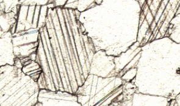

## (ColorSeg) Eltérő színű szemcsék szegmentálása

Márványoknál alapesetben nem jellemző, hogy a szemcsék eltérő színűek lennének, de polarizált fényes megvilágítás esetén már ott is előkerül ez az eset, más kőzeteknél pedig gyakori jelenség. Ilyenkor a szegmentáció kihasználhatja a színbeli hasonlóságokat, ami jelentős könnyebbséget jelent az egyforma színű szemcsékkel szemben.

## (LowContrast) Alacsony kontrasztú képek kezelése

Vannak olyan márvány képek, melyek kontrasztja nagyon alacsony, esetleg a szemcsehatárok nem nem is látszanak mindenhol. Ilyenkor a hagyományos szegmentációs megközelítés nem működik, viszont a még látható vonalak alapján szemcseméreteket becsülni továbbra is lehet. Első körben például ki lehet próbálni, hogy mekkora ellipszisekkel lehetne lefedni a képet anélkül, hogy a látható vonalak egy ellpiszisen belülre esnének.

## (AC) Szemcsehatárok keresése active contours megközelítéssel

Az active contourok (snake) olyan zárt hurkok, melyeket egyfajta fizikai szimulációval mozgat a rendszer, hogy azok minél jobban rásimuljanak a határvonalakra. A görbéket különböző erők mozgatják: van, ami a kontúrok felé húzza őket, vannak, amik pedig nem engedik, hogy túlságosan megtörjenek a vonalak (simasági kritériumok biztosítása).

Hasonló megközelítést követnek a network snake-ek, melyek nem hurkokat, hanem egy hálót optimalizálnak hasonló módon. Egyik tipikus alkalmazás az orvosi képfeldolgozásban a sejtek határainak azonosítása.

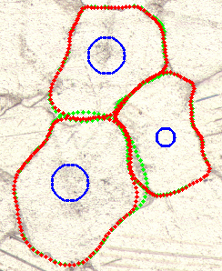

A kép Öllős Gábor Active Contours módszerével készült.

# Szemcsehatárok további pontosítása, javítása

Ezek az altémák egy már lefutott szegmentáció után kezdik el javítani az eredményeket. Van, amelyik felhasználói segítséggel, van, ami optimalizálási algoritmusokkal, és olyan is van, ami mindkettővel.

## (Decomp) Szemcsék felbontása szemcsahatár-gyanús részek mentén

Előfordul, hogy a képszegmentáció néhány szemcsét összevon, mivel azok között a határvonal nem volt folytonos. Ilyenkor érdemes a szemcsét külön is megvizsgálni, hogy fel lehet-e vágni hihetőbb alakú részekre. A hihetőségnek az egyik mértéke például a konvexitás: nagyon nagy beugrások nem szoktak előfordulni a kalcit kristályokban, így ha a szemécsét felbontjuk közel konvex részekre (Minimal Near Convext Decomposition), akkor azzal valószínűleg javítunk a képszegmentáció minőségén.

## (1-click) "Egy kattintásos üzemmód" fejlesztése

Ennek a megoldásnak az a lényege, hogy a felhasználót megkérjük, minden szemcsére pontosan egyszer kattintson rá (vagy satírozzon bele). Ezt lényegesen gyorsabb megtenni, mint körberajzolni a határokat, viszont a program számára nagyon hasznos információ, hogy pontosan hány szemcsét kell megtalálni és azok nagyjából hol vannak. (Addig kell növelni a megtalált szemécsket, amíg már minden terület pontsan egy szemécshez tartozik.)

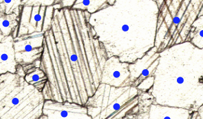

## (OptMerge) Szemcse-darabok összevonása optimalizációs módszerekkel (GA vagy RJMCMC)

Több itt említett módszer végeredményében előfordul (véletlenül vagy széndékosan), hogy a tényleges szemcsék több darabra fel vannak vágva. Ilyenkor egy külön optimalizációs kérdés, hogy ezeket a darabokat hogyan kell összevonni ahhoz, hogy a tényleges szemcséket kapjuk meg. Ilyenkor általában definiálunk egy a szemcsehalmazokon értelmezett jóságú függvényt, melyet megpróbálunk maximalizálni. A függvény vizsgálhatja a szemcse méreteket, a bennük lévő esetleges kontúrokat, a  határvonalak eltérő színét, a szemcse konvexitását stb.

Az optimalizálásra többek között lehet használni generikus (GA) vagy monte-carlo (RJMCMC) alapú algoritmusokat.

Ennek a megoldásnak a kiindulási alapja lehet egy sűrű négyzetrács (mint kezdeti szegmentáció), drasztikusabb szegmentáció, esetleg a szemcsék utólagos darabolása (Minimal Near-Convex Decomposition).

Ezen kívül a megközelítést össze lehet vonni a 1-click irányvonallal is, ahol a felhasználótól azt már tudjuk, hogy hány szemcse van és nagyjából hol találhatóak ezek.

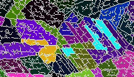

Az ábra Barancsuk Lilla algoritmusának kiindulási állapota.

# Hasznos információk kinyerése a szemcse rajzolatból

Az alábbi témák abból indulnak ki, hogy a szemcsék határait sikerült beazonosítani. Ez után következnek a jellemző tulajdonságok kinyerései, a kőzet eredetének azonosítása osztályozási módszerekkel stb.

## (Shape) Szemcse alakzat jellemzése

Az osztályozási feladatokhoz minél több olyan jellemzőt kell kinyernünk a képekből, amik alapján meg lehet különböztetni az egyes márványokat. A szemécsék mérete mellett a képfeldolgozásban számos alakzat jellemzőt találunk (péládul terület-kerület arány, momentumok, fraktál dimenzió és még rengeteg más), melyeket érdemes megvizsgálni, hogy mennyire hasznosak a márványok megkülönböztetésében.

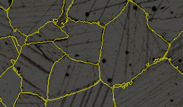

## (Sand) Homokkő csiszolatok vizsgálata

A márványok mellett a fejlesztések egy oldalága a homokkövek vizsgálata. Első körben azért, mert restaurálási célokra akkor alkalmas (elegendően stabil) egy homokkő, ha egy szemcséjének átlagosan legalább 3.6 hozzáérő szomszédja van. Ellenkező esetben a kő túlságosan porózus, így hamar tönkremenne.

A szomszédok átlagos számát kézzel meghatározni nagyon időigényes munka. Ha a GrainAutLine alkalmazás meg tudja határozni a szemcsék helyét, akkor az alapján a szomszédok számát már könnyen ki lehet nyerni, ami főleg sok minta esetében drasztikusan fel tudja gyorsítani a vizsgálati folyamatot. (Márpedig restaurálási célra sok lehetésges alapanyag rendelkezésre áll, nem ritka a 100-nál több minta.)

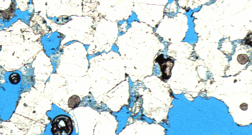

A képen a kék részek a befestett porozitások (ahova befolyt a kék festék).

## (TwinDir) Ikerkristályok domináns irányainak meghatározása

A szemehatárok megharározásánál az ikerkristályokat alapvetően zavaró zajnak tekintjük, viszont ha már szét vannak választva a igazi szemcsehatárok és az ikerkristály vonalak, akkor ez utóbbiakból hasznos információkat is ki lehet nyerni. Például meg lehet harározni a kőzet kialakulása során jellemző terhelési irányokat, amiből (ha tudjuk, milyen orientációban volt a minta eredetileg), a környék domborzati fejlődésére is következtethetünk.

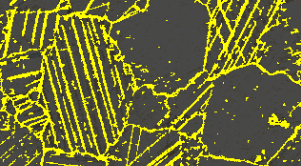

## (MGS) MGS kiértékelési módszerek összehasonlítása

A Maximal Grain Size egy gyakran használt mérték a márványok eredetének azonosítására. Meghatározása sokszor szemmel, mikroszkópon keresztül történik (tipikus nagyságrendje 0.5-2 mm). Viszont ha a szemcseméretet egy valószínűségi változónak tekintjük, akkor a maximumot megkeresni nem túl nyerő dolog: ha csak egyetlen nagy szemcse is valahogy bekerül a csiszolatba, de egyébként egyáltalán nem jellemző a mintára, akkor téves következtetéseket vonhatunk le.

Egy másik tipikus módszer a meghatározására, hogy a minta képen egy vonalat húzunk és megnézzük, a vonal mentén milyen hosszú szakaszok esnek egy szemécsbe, és ezek maximumát vesszük. Ilyenkor jó eséllyel az egyes szemcséknek nem a maximális méretét merjük (mivel csak a vizsgáló vonal mentén mérünk).

Az ehhez kapcsolódó feladat a már elkészített szemcsehatár-rajzolatok segítségével mérések készítése és futtatása: érdemes lenne megmérni, hogy a fenti módszerekkel mért MGS mennyire megbízható. Mennyivel nagyobb például a szórása annál, mint hogyha a szemcseméret hisztogram alapján nem a maximális értékét vesszük, hanem a legnagyobb 1% eldobása után megmaradó legnagyobb értéket (99%-os percentilis).

Minden módszert lehet úgy vizsgálni, hogy egy ablakot végigcsúsztatunk egy nagyobb márványképen és az ablakon belül meghatározzuk az MGS-t, majd a kapott eredményeknek megnézzük a szórását: ha nagyon nagy, az azt jelenti, hogy túlságosan függ attól, hogy éppen honnan vettük a mintát, ami pedig nem egy szerencsés jelenség.

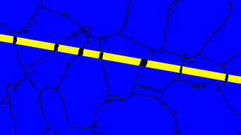

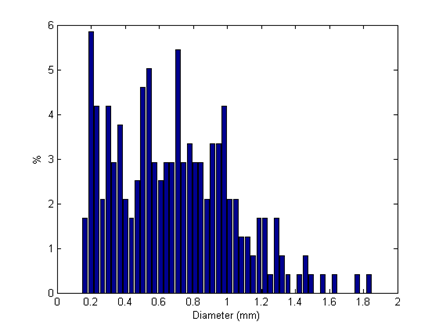

## (Class) Osztályozási feladatok

A GrainAutLine rendszer egyik elsődleges célja a márványok eredetének meghatározása. Jelenleg ez tipikusan stabil izotópok (C13 és O18, Sr87/Sr86) és a Maximal Grain Size (MGS) alapján történik. A mi feladatunk, hogy további, képfeldolgozáson alapuló tulajdonságokat nyerjünk ki, majd azokkal együtt pontosabb osztályozást tegyünk lehetővé.

Ennek a folyamatnak az utolsó pontja az osztályozási módszerek vizsgálata, mint például a Bayes döntés, Maximum Likelihood (ML) döntés, Linear Discriminant Analysis (LDS), Support Vector Machine (SVM), döntési fa építés például information gain alapokon stb.

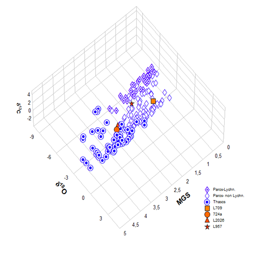

Az ábra a [www.missmarble.info](http://www.missmarble.info/) adatbázis alapján készült.

# GrainAutLine keretrendszer fejlesztése

Az alábbi témák célja inkább fejlesztési, mint kutatási: a GrainAutLine rendszer fejlesztése mind felhasználói élmény szempontjából, mind a kutatási feladatok könnyítésének céljából.

## (UI) Felhasználói felület továbbfejlesztése

A GrainAutLine felhasználói felülete fontos, hogy ergonómikus és könnyen használható legyen, mivel a célfelhasználók jelentős része nem informatikus. (És nem is szeretik azt, ha IT-Magic kell a használatához, ami teljesen érthető.)

* A Qt+QML alapú felhasználói felület fejlesztése, minél ergonómikusabb kialakítása (Ez lehet sima fejlesztési feladat is.)
* Szerkesztő eszközök kitalálása, melyek a felhasználó munkáját könnyítik. Ezek komplexitása nagyon tág skálán mozog: vannak egyszerű rajzolási funkciók, de akár olyanok is, amik komoly képfeldolgozási műveletsorokat rejtenek.
* Azért, hogy a szemcsék határai jól látszódjanak, érdemes eltérő színnel megjeleníteni a szemcséket. Hogy ne kelljen nagyon sok szín (mert akkor lesz, ami nagyon hasonlít, vagy nem látszik rajta a többi információ), érdemes ezt gráfszínezéses módszerrel elvégezni, hogy minél kevesebb szín kelljen, de két egymás melletti szemcse ne legyen egyforma színű.

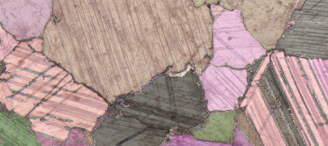

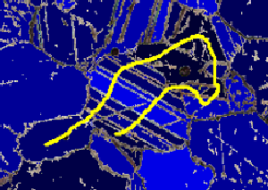

## (Eval) Automatikus pontosság-kiértékelő környezet kialakítása

A GrainAutLine rendszer akkor jó, ha a szemcsehatárokat magától is minél pontosabban meg tudja határozni. Ehhez kell egy automatikus kértékelő keretrendszer, mely előre elkészített tesztképeket megetet a programmal, kiértékelteti őket, majd a mintamegoldással összeveti az eredményeket. A tesztek futtatását minél automatikusabban végzi (akár continuous integration környezetben is) és az eredményekből tömör jelentést generál.

## (CI) Unit tesztek és continuous integration környezet kialakítása

Mivel sokan dolgoznak a programon, fontos a folyamatos regressziós tesztelés. Bár a fejlesztők mind készítenek unit teszteket a saját részeikhez, ezek összefogása és automatikus futtatása egy continuous integration szerveren (Jenkins) külön is egy megoldandó feladat.

# Egyéb, még be nem sorolt ötletek

* 2D autokorreláció alapú szemcse azonosítás: ha nagyon sok az ikerkristály vonal (van ilyen márvány), akkor a szemcsék abban is különbözhetnek, hogy az ikerkristály vonalak irányai eltérnek bennük. Ehhez egy csúszóablakot végigtolva a képen meg lehet határozni minden pozíciónak az autokorrelációját, majd a hasonló autokorrelációjú helyeket összegyűjteni a képen. (A 2D autokorreláció ebben az esetben egy 2D függvény, mely minden a középponthoz képesti elmozdulásra (pl. x+3, y-4) megmondja, hogy az ott talált érték milyen korrelációban áll a középpont értékéhez képest. Például a párhuzamos vonalak nagyon szépen látszanak egy ilyen függvények (képen), mert a domináns irányban nagy a korreláció, más irányokba pedig jóval kisebb.)

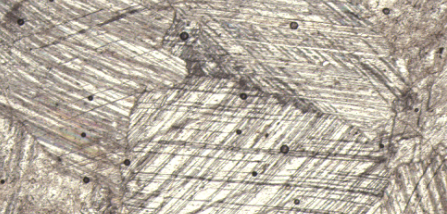
